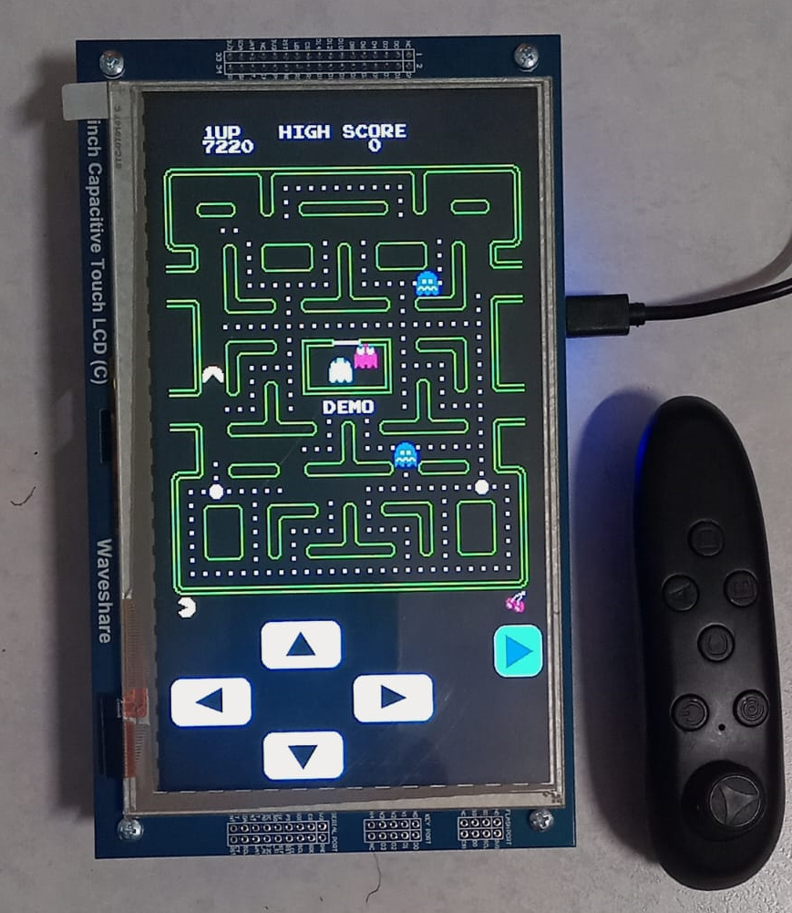

# Pacman

This is a project based on the code from https://github.com/MhageGH/esp32_ILI9328_Pacman Arduino Pacman Version, which in turn is based on a repository that doesn't exist anymore.

## Game Controller

There are 2 ways to play using:
- Touch Screen buttons
- BLE VR HID Remote Control

For more information about the BLE VR controller, please go to 
https://github.com/BigJBehr/ESP32-Bluetooth-BLE-Remote-Control

The S3 devkit has a neopixel LED. As soon as the board is turned on, it will turn Red.
The S3 will try to scan and find the BLE VR controller.
It it finds the BLE VR device, the LED turns Blue.
Otherwise it will keep Red. In case the BLE VR Controller is out of range or turned off, the LED goes to Red.

In order to reconnect, it is necessary to reset the board.
Use the Joystick and the 2 "fire" buttons to Play/Pause the game.

## How to build

The project was built using the Arduino IDE and the ESP32S3 Dev Module Board.
It is necessary to enable PSRAM option in the menu. In the case of the ESP32-S3-WROOM-1, select QSPI PSRAM option.

## Hardware

The board is an ESP32-S3-WROOM-1 sdkdev kit with a display of 7 inches.
It uses a 800x480 RA8875 parallel 16 bits display and GT911 TouchScreen.

The Display used is similar to the one from this repository:
https://github.com/espzav/Multiple-LCD-Demo

### Schematic:

